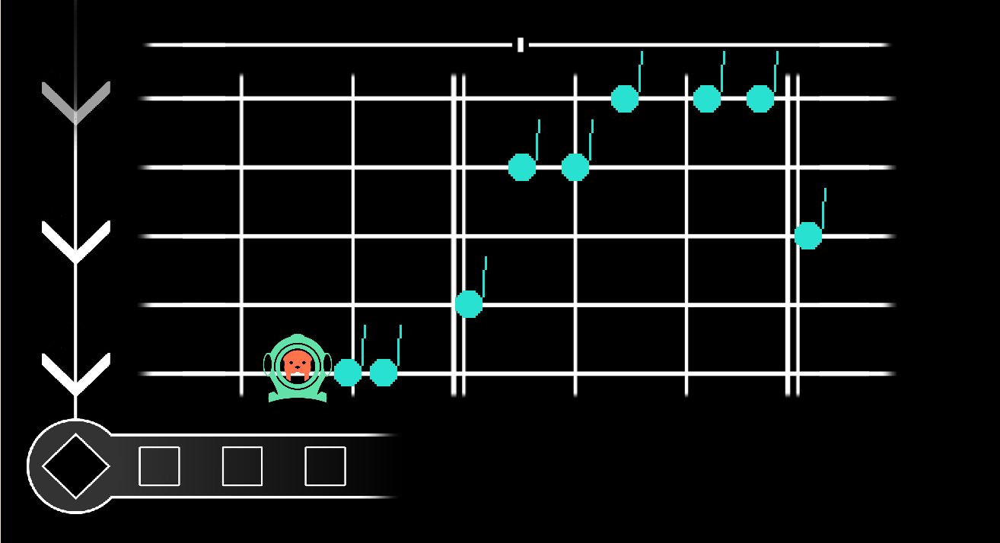

# $\color{rgb(118,165,175)} {\textbf{Sawa's Song}}$

Sawa es una nutria de agua dulce dispuesta a ganar la batalla musical más importante de todas las aguas. Para ello, nuestra nutria tendrá que ir derrotando a sus oponentes, aprendiendo nuevas técnicas musicales y desarrollando su talento con multiples instrumentos.  

El juego puede ser jugado en página web a traves de este [link](https://izandevegalopez.github.io/proyecto_PVLI/)

## $\color{rgb(230,145,56)} {\textbf{Historia}}$
Este juego es un proyecto de estudiantes universitarios en 2º año de la carrera de Desarrollo de Videojuegos en la UCM para la asignatura Programación de Videojuegos en Lenguajes Interpretados (PVLI) durante el curso 2024-2025

## $\color{rgb(230,145,56)} {\textbf{RedesSociales}}$
[Twitter](https://x.com/FathomGames1)
[Discord](https://discord.gg/Fqsc9G9W)
[Youtube](https://www.youtube.com/channel/UCYzZh8CjlzoX60kzE2s3ylw)
[Instagram](https://www.instagram.com/fathomgames1/)
